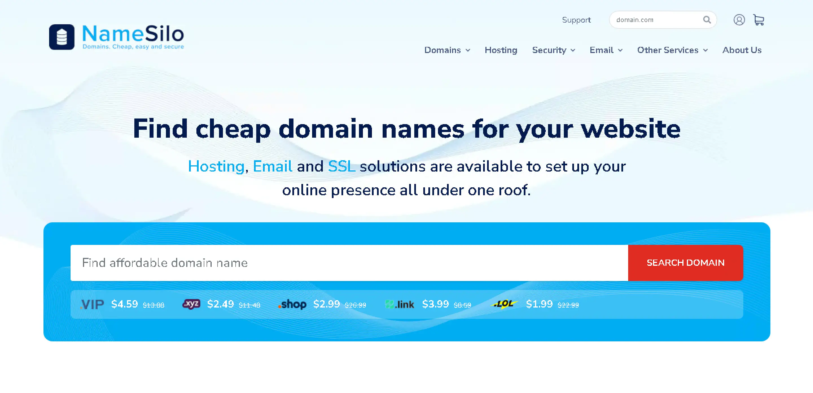

# 2025年最新NameSilo优惠码 - 可优惠1美元

## NameSilo 介绍
NameSilo是一家知名的国际域名注册服务商，以低廉的价格、稳定的服务和免费的隐私保护功能闻名。NameSilo支持广泛的顶级域名（TLDs）注册，是许多用户首选的域名注册平台。
NameSilo 核心特性一览
- 价格实惠透明：域名注册和续费价格一致，无首年低价套路，长期持有成本低。

- 终身免费隐私保护：所有域名均免费提供 WHOIS 隐私保护，可隐藏您的姓名、邮箱等个人信息，防止垃圾邮件骚扰。

- 支持国内支付：可直接使用支付宝 (Alipay) 和银联 (UnionPay) 付款，无需国际信用卡。

- 界面干净无广告：管理后台简洁明了，没有干扰性的广告和向上推销。

- 安全保障：免费提供 Domain Defender 安全服务，通过多重验证保护您的域名，防止被盗。

- 免费增值服务：免费提供域名停放、邮箱转发等实用功能。

## NameSilo 官网地址
- [https://www.namesilo.com](https://www.namesilo.com/?rid=691b886ie)

## NameSilo 优惠码
NameSilo为新用户提供多种优惠码，以下是一些当前有效的优惠码，新用户首次注册可以享受1美元立减优惠：
- **VIP123**
- **VIP16888**
- **vip999**

## NameSilo 优惠活动
以下是NameSilo目前的一些优惠活动，这些活动可以帮助用户在域名注册和续费时节省费用：

| 优惠活动名称       | 优惠详情                  | 链接                                       |
|-----------------|-------------------------|------------------------------------------|
| 新用户注册优惠      | 首次注册域名立减1美元          | [点击获取优惠](https://www.namesilo.com/?rid=691b886ie) |
| 续费优惠          | 续费价格稳定，无需优惠码         | [查看续费详情](https://www.namesilo.com/?rid=691b886ie) |

## NameSilo 评测
NameSilo因其优惠的价格、稳定的服务以及用户友好的管理界面而受到用户的高度评价。此外，NameSilo提供的API功能丰富，使得技术用户可以轻松集成和自动化域名管理任务。

### 如何使用NameSilo优惠码
使用NameSilo优惠码非常简单，用户只需在结账时输入优惠码即可享受折扣。以下是使用优惠码的步骤说明：
1. 选择您要注册的域名。
2. 在购物车页面找到“Have a Coupon or Promotion Code?”输入框。
3. 输入优惠码，例如`VIP16888`，然后点击提交。
4. 系统将自动更新价格，反映出优惠。
